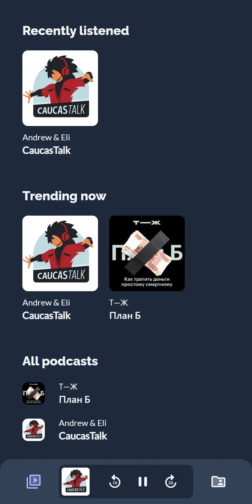

<a href="https://stats.uptimerobot.com/NnXDYFZ5zq"></a><a href="https://cast-iu.pages.dev"></a>


[](https://github.com/aabounegm/cast/actions/workflows/unit-test-main.yml)
[](https://stats.uptimerobot.com/NnXDYFZ5zq)

## Features

- 📱 Listen to podcasts from any web browser
- ⬇️ Download podcasts to listen offline
- 📄 Read the transcript when listening is not an option
- ❤️ Save your favorite podcasts for quick access
- ☁️ Sync your favorites and listening history with a GitHub account

<details>
  <summary><strong>Screenshots</strong></summary>
  <table>
    <tbody>
      <tr>
        <td></td>
        <td></td>
        <td></td>
      </tr>
    </tbody>
  </table>
</details>

## Quality assurance

The quality of this application and its codebase is secured with these awesome tools:

- [x] [Feature Sliced Design](https://feature-sliced.design) dictates code structure
- [x] [ESLint](https://eslint.org) and [Prettier](https://prettier.io) enforce code style and help catch bugs early on
- [x] [TypeScript](https://www.typescriptlang.org/) provides strict type safety
- [x] [Husky](https://typicode.github.io/husky) installs Git hooks to run static checkers before each commit
- [ ] [Jest](https://jestjs.io/) helps to test each unit in isolation
- [x] [Cypress](https://www.cypress.io/) helps to the application end-to-end
- [ ] [Lighthouse CI](https://github.com/GoogleChrome/lighthouse-ci) continously measures application performance
- [x] [GitHub Actions](https://github.com/features/actions) run each pull request against a CI pipeline
- [x] [Cloudflare Pages](https://pages.cloudflare.com/) automatically deploy code for `main` and pull requests
- [x] [UptimeRobot](https://uptimerobot.com/) ensures the app is up and running
- [ ] OWASP Web Security Checklist ensures the application's security

## Running locally

Run it like any other Node.js app, first the dependencies, then the `dev` script:

```bash
pnpm install
pnpm dev
```

## Meet the team

<table>
  <thead>
    <th><a href="https://github.com/aabounegm">@aabounegm</a></th>
    <th><a href="https://github.com/alkaitagi">@alkaitagi</a></th>
    <th><a href="https://github.com/illright">@illright</a></th>
    <th><a href="https://github.com/khaledismaeel">@khaledismaeel</a></th>
    <th><a href="https://github.com/VanishMax">@VanishMax</a></th>
  </thead>
  <tbody align="center"><tr>
    <td></td>
    <td></td>
    <td></td>
    <td></td>
    <td></td>
  </tr><!--
  <tr>
    <td>CI / CD</td>
    <td>Podcast player</td>
    <td>Design</td>
    <td>Backend</td>
    <td>Podcast player</td>
  </tr>--></tbody>
</table>

## License

The source code of this project is distributed under the terms of the MIT license. [Click here](https://choosealicense.com/licenses/mit/) to learn what that means.
